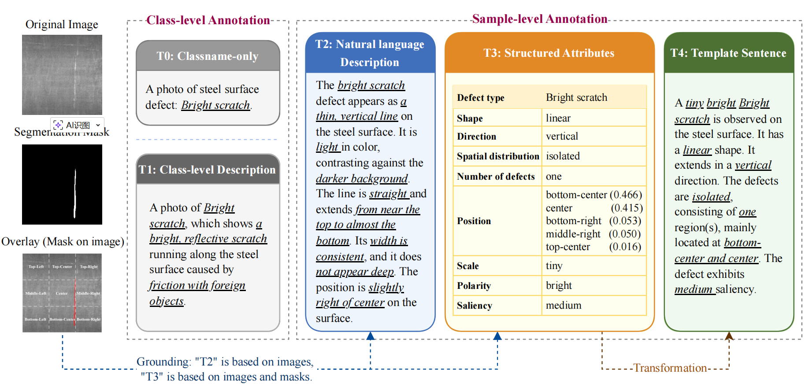

# SteelDefectX 

<p align="center">
  <strong>A Multi-Form Vision-Language Dataset and Benchmark for Steel Surface Defect Analysis</strong>
</p>

<p align="center">
  <a href="https://huggingface.co/datasets/Zhaosxian/SteelDefectX">🤗 Dataset on Hugging Face</a>
</p>

<p align="center">
  
</p>

<p align="center">
  
  
  
  
</p>

SteelDefectX is a multi-form vision-language dataset that unifies four public industrial defect benchmarks into a single steel-surface dataset. It provides pixel-level masks, class-level descriptions (T1), and three complementary sample-level text annotations (T2–T4), enabling controllable and interpretable vision-language learning.

| Text form | Field | Role |
| :---: | --- | --- |
| T1 | `class-level description` | Provides category-level semantics, including defect name, representative visual attributes, and potential industrial causes |
| T2 | `natural_language_description` | Free-form image-level description with rich visual semantics |
| T3 | `structured_attributes` | Nine-field attribute representation for stable and controllable supervision |
| T4 | `template_sentence` | Linearized T3 representation for standardized and consistent text prompts |

## Dataset Structure

```text
SteelDefectX/
├── class_descriptions.json
├── train/
├── train_mask/
├── train-text.json
├── val/
├── val_mask/
└── val-text.json
```

## Annotation Schema

Each sample is organized as:

```json
{
  "image_name": "bs_01.jpg",
  "class_name": "Bright scratch",
  "natural_language_description": "The bright scratch defect appears as a thin, vertical line on the steel surface. It is light in color, contrasting against the darker background. The line is straight and extends from near the top to almost the bottom. Its width is consistent, and it does not appear deep. The position is slightly right of center on the surface.",
  "structured_attributes": {
    "Defect type": "Bright scratch",
    "Shape": "linear",
    "Direction": "vertical",
    "Spatial Distribution": "isolated",
    "Number of Defects": "one",
    "Position": [["bottom-center", 0.466667], ["center", 0.415504], ["bottom-right", 0.052713], ["middle-right",0.049612], ["top-center", 0.015504]],
    "Scale": "tiny",
    "Polarity": "bright",
    "Saliency": "medium"
  },
  "template_sentence": "A tiny bright Bright scratch is observed on the steel surface. It has a linear shape. It extends in a vertical direction. The defects are isolated, consisting of one region(s), mainly located at bottom-center and center. The defect exhibits medium saliency."
}
```

## Annotation Pipeline

### 1. Generate T2 Descriptions

Script: `generate_natural_language_descriptions.py`

Example:

```bash
export OPENAI_API_KEY=YOUR_KEY

python generate_natural_language_descriptions.py \
  --input-dir train \
  --output-json train_t2.json \
  --embedding-model-path saved_model \
  --model-name gpt-4o
```

### 2. Compute Deterministic Statistics

Script: `data_analysis.py`

Example:

```bash
python data_analysis.py \
  --image-dir train \
  --mask-dir train_mask \
  --output-dir analysis_outputs/train
```

Outputs:

- `per_image_statistics.csv`
- `global_summary.json`
- Histogram plots for scale, polarity, saliency, component count, and largest-component ratio

### 3. Build T3 and T4 Annotations

Script: `build_structured_text_annotations.py`

Example:

```bash
export OPENAI_API_KEY=YOUR_KEY

python build_structured_text_annotations.py \
  --input-json train_t2.json \
  --image-dir train \
  --mask-dir train_mask \
  --output-json train-text.json \
  --statistics-output-dir analysis_outputs/train
```

If `--statistics-output-dir` is omitted, the script still computes the required statistics internally but does not export the intermediate CSV, JSON, or plots.

## Technical Notes

- Data sources: [NEU](https://pan.baidu.com/s/1l_RjTP7aTwr57ahcwelTpA), [GC10](https://github.com/lvxiaoming2019/GC10-DET-Metallic-Surface-Defect-Datasets), [X-SDD](https://github.com/Fighter20092392/X-SDD-A-New-benchmark), and [S3D](https://github.com/VDT-2048/ETD).
- Image resolution: all images are standardized to `256 x 256`.
- Mask format: binary PNG masks where foreground pixels indicate defect regions.
- Runtime secrets should be provided with environment variables such as `OPENAI_API_KEY`.
- `OPENAI_API_BASE` can be set when using an OpenAI-compatible endpoint.

See the associated paper for detailed methodology on multi-form annotation generation and comprehensive benchmark results.

## Citation

If you use this dataset, please cite the associated paper.
